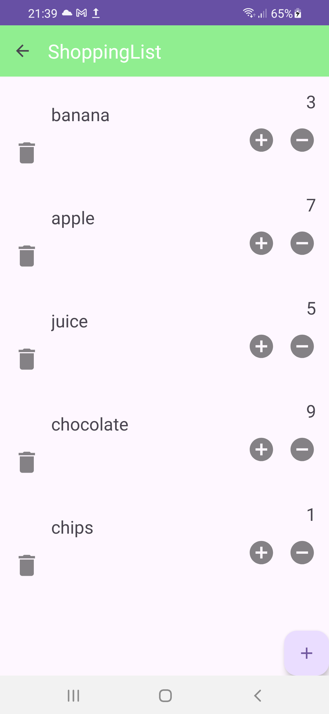
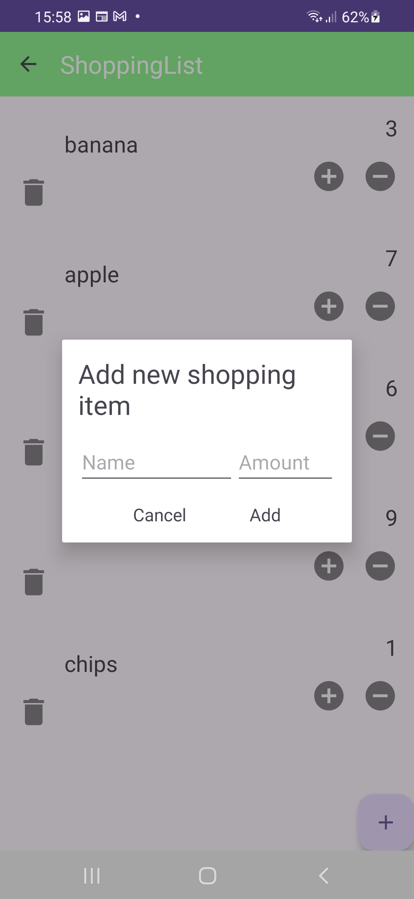

# ShoppingListApp

## Overview

**ShoppingListApp** is a simple Android application designed to manage a shopping list. The app follows the MVVM (Model-View-ViewModel) architecture pattern, integrates Room for SQLite database operations, and utilizes Kodein for dependency injection. This setup ensures a clean and maintainable codebase while leveraging modern Android development practices.

## Features

- **MVVM Architecture**: Ensures a separation of concerns between data, UI, and business logic.
- **Room with SQLite**: Manages local data storage efficiently.
- **Kodein**: Simplifies dependency injection throughout the application.

## Architecture

### MVVM (Model-View-ViewModel)

- **Model**: Manages the data and business logic. Includes:
  - Room Entities
  - DAO interfaces
  - Repository pattern for data operations
- **View**: Represents the UI elements (e.g., Activities, Fragments) and handles user interactions.
- **ViewModel**: Connects the Model and the View. Manages UI-related data and business logic, ensuring persistence across configuration changes.

### Room with SQLite

- **Entity**: Defines the structure of the database table.
- **DAO (Data Access Object)**: Provides methods for accessing and manipulating the database.
- **Database**: The Room database class that manages database creation and version management.

### Kodein

- **Dependency Injection**: Kodein is used to handle dependency injection, making it easier to manage and inject dependencies across various components of the application.

### Images of the App

&nbsp;&nbsp;&nbsp;
  

